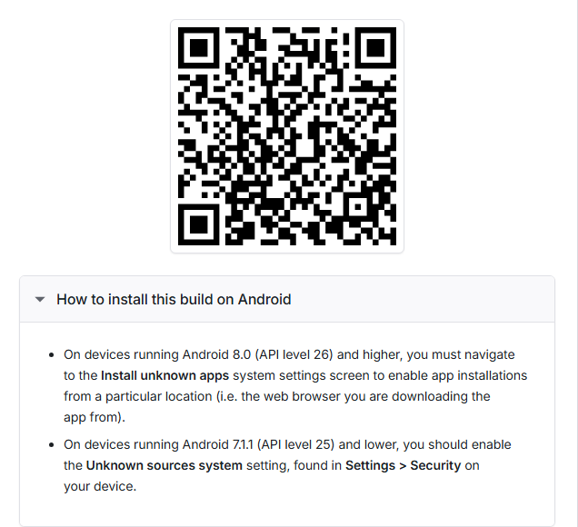

# Gym Tracker App
A personal fitness tracking app built to replace ad-heavy gym apps

### For Users

*Scan to download the APK for Android*

## Features

- **Workout Management** - Create custom workouts, add exercises, and track sets/reps
- **Progress Tracking** - Monitor strength gains and workout history over time
- **Rest Timer** - Customizable timer with quick presets (60s, 90s, 120s, 180s)
- **Exercise Library** - Browse exercises by muscle group
- **Workout History** - View and edit past workouts

## Tech Stack

- **Frontend:** React Native (Expo), TypeScript
- **State Management:** Zustand
- **Backend:** Supabase (PostgreSQL)
- **Build:** EAS Build
